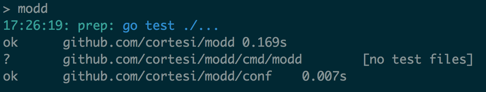
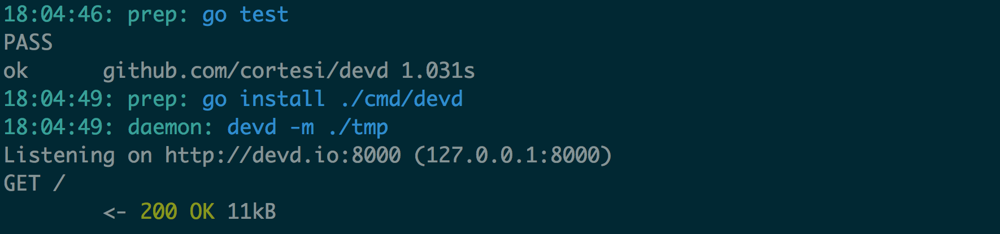

[](https://drone.io/github.com/cortesi/modd/latest)

# modd

Modd triggers commands and manages daemons in response to filesystem changes.

# Install

Go to the [releases page](https://github.com/cortesi/modd/releases/latest),
download the package for your OS, and copy the binary to somewhere on your
PATH.

If you have a working Go installation, you can also say

    go get github.com/cortesi/modd/cmd/modd


# Quick start

Put this in a file called **modd.conf**:

```
**/*.go {
    prep: go test
}
```

Run modd like so:



Whenever any file with the .go extension is modified, the "go test" command
will be run.


# Leisurely start

When modd is started, it looks for a file called **modd.conf** in the current
directory. This file has a simple, powerful syntax - one or more blocks, each
starting with a set of file patterns, and a specifying set of commands to run
when any matching file changes.

Commands have two flavors: **prep** commands that run and terminate (e.g.
compiling, running test suites or running linters), and **daemon** commands
that run and keep running. Daemons are sent a SIGHUP (by default) when their
block is triggered, and will be restarted if they exit unexpectedly.

Below is a slightly simplified version of the modd.conf file I use when hacking
on devd. It runs the test suite, builds and installs devd, and keeps a test
daemon instance running throughout:

```
**/*.go {
    prep: go test
    prep: go install ./cmd/devd
    daemon: devd -m ./tmp
}
```

Output on startup looks like this:



All prep commands in a block are run in order of occurrence before any daemon
is restarted. If any prep command exits with an error, execution is stopped.

There's one small problem with this devd example - when devd gets a SIGHUP it
doesn't exit, it triggers browser livereload. This is *precisely* what you want
when devd is being used to serve a web project you're hacking on, but when
developing devd itself, we actually want it to exit. So, we tell modd to send a
SIGTERM to the daemon instead, which has the desired result:

```
**/*.go {
    prep: go test
    prep: go install ./cmd/devd
    daemon +sigterm: devd -m ./tmp
}
```


# Features

### Cross-platform and self-contained

Modd is a single statically compiled binary with no external dependencies, and
is released for OSX and Linux.

### Works well with programmers

Modd is designed to be a simple, reliable that does what's needed and gets out
of your way.


### Works well with devd

Modd's sister project is [devd](https://github.com/cortesi/devd), a compact
HTTP daemon for developers. Devd integrates with modd, allowing you to trigger
in-browser livereload after static resource rebuilds complete.

### Does file change detection right

Or at least tries. Usefully responding to file system changes is a hairy,
knotty, horrible problem, and most tools similar to modd simply don't get it
right. Modd aims to do the best possible job across all platforms for typical
developer work patterns. It ignores temporary files, VCS directories, swap
files and many other nuisances by default. Its detection algorithm waits for a
lull in filesystem activity so that events are triggered **after** render or
compilation processes that may touch many files. Modd tries to do the right
thing in corner cases, like receiving file modification notice while previously
triggered commands are being run.


# Config file format

A modd config file consists of one or more blocks, each starting with a set of
file watch patterns, and specifying a set of **prep** and **daemon** commands
to run. Here's an example showing all the basic features of the format:

```
# File patterns can be naked or quoted
**/*.js "**/*.html" {
    # Commands are executed in a shell, and can make full use of shell
    # capabilities like piping and output redirection
    prep: echo "i'm now rebuilding" | tee /tmp/output

    # Commands can be quoted. Newlines are stripped from quoted commands, so
    # escaping line endings when arguments span multiple lines is not needed
    prep: "
        ls
            -l
            -a;
        echo 'and hello again';
    "
}

# A double-asterisk recursively matches all files so this block will trigger on
# any change
** {
    prep: go test
}

# This is a special block with no file match pattern. This means prep commands
# run once only at startup, and daemons are kept running but never restarted by
# modd.
{
    prep: echo "i run exactly once"
}
```

## File watch patterns

Watch patterns support the following terms:

Term          | Meaning
------------- | -------
`*`           | any sequence of non-path-separators
`**`          | any sequence of characters, including path separators
`?`           | any single non-path-separator character
`[class]`     | any single non-path-separator character against a class of characters
`{alt1,...}`  | any of the comma-separated alternatives - to avoid conflict with the block specification, patterns with curly-braces should be enclosed in quotes

Any character with a special meaning can be escaped with a backslash (`\`).
Character classes support the following:

Class      | Meaning
---------- | -------
`[abc]`    | any character within the set
`[a-z]`    | any character in the range
`[^class]` | any character which does *not* match the class


## Running commands

All processes inherit the parent environment.
